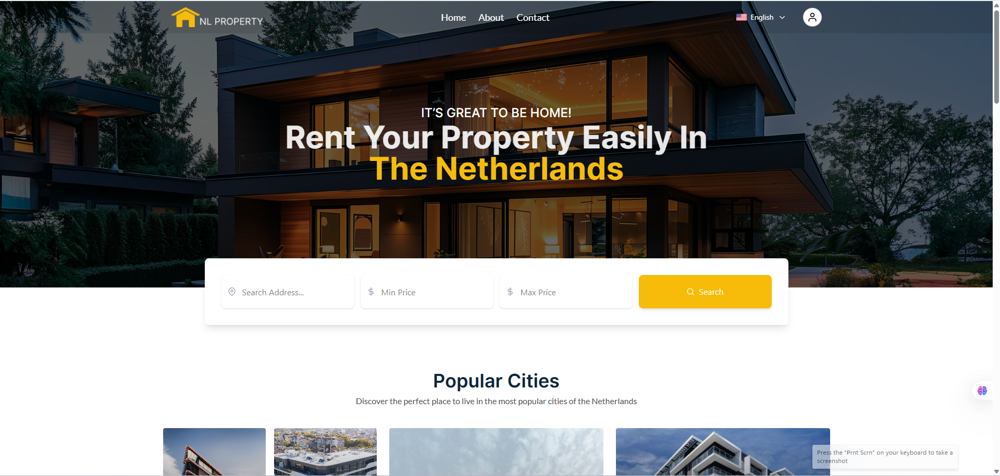

# 🏠 Rental Application (React)

A full-featured rental application built with **React**. Users can browse, search, and book rental properties. The platform includes property details, user authentication, reviews, and a responsive UI optimized for all devices.

---

## ✨ Features

- 🔍 Browse and search for rental listings
- 🏡 View property details with image gallery
- 📝 Add and view reviews
- 🔐 User authentication (Login/Register)
- 💾 User profile with saved listings
- 📱 Fully responsive design
- ⚡ Fast and modern UI built with React

---

## 🚀 Tech Stack

- **Frontend**: React, React Router, Tailwind CSS
- **State Management**: useState, useEffect, Context API
- **Routing**: React Router DOM
- **API**: Axios
- **Authentication**: JWT (via localStorage)
- **Deployment**: Vercel (Frontend)

---

## 📁 Folder Structure

## 🔧 Installation

1. **Clone the repo:**

   ```bash
   git clone https://github.com/MTS-Services/react-initialize

   cd react-initialize

   npm install

   npm run dev

   http://localhost:5173

   ```

---

## 🎨 Tailwind Development vsCode Editor setup

### Step-1 : To get started, install prettier-plugin-tailwindcss as a dev-dependency:

```js
npm install -D prettier prettier-plugin-tailwindcss
```

### Step-2 : Then add the plugin to your Prettier configuration:

```js
// .prettierrc
{
  "plugins": ["prettier-plugin-tailwindcss"]
}
```
